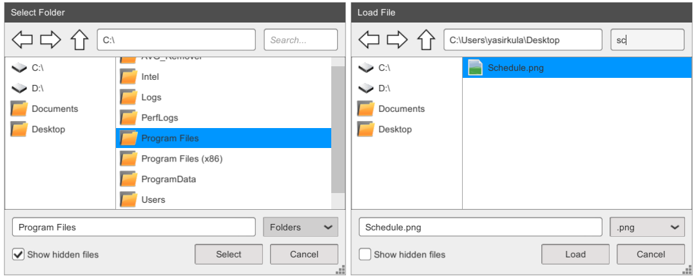

# Unity Simple File Browser



**Available on Asset Store:** https://assetstore.unity.com/packages/tools/gui/runtime-file-browser-113006

**Forum Thread:** https://forum.unity.com/threads/simple-file-browser-open-source.441908/

**Discord:** https://discord.gg/UJJt549AaV

**[GitHub Sponsors ☕](https://github.com/sponsors/yasirkula)**

## FEATURES

- Behaves similar to Windows file chooser
- Ability to search by name or filter by type
- Quick links
- Simple user interface
- Draggable and resizable
- Ability to choose folders instead of files
- Supports selecting multiple files/folders
- Can easily be reskinned
- Supports runtime permissions on Android M+ and *Storage Access Framework* on Android Q+
- Optimized using a recycled list view (makes *Instantiate* calls sparingly)

**NOTE:** *Universal Windows Platform (UWP)* and *WebGL* platforms aren't supported!

## INSTALLATION

There are 5 ways to install this plugin:

- import [SimpleFileBrowser.unitypackage](https://github.com/yasirkula/UnitySimpleFileBrowser/releases) via *Assets-Import Package*
- clone/[download](https://github.com/yasirkula/UnitySimpleFileBrowser/archive/master.zip) this repository and move the *Plugins* folder to your Unity project's *Assets* folder
- import it from [Asset Store](https://assetstore.unity.com/packages/tools/gui/runtime-file-browser-113006)
- *(via Package Manager)* add the following line to *Packages/manifest.json*:
  - `"com.yasirkula.simplefilebrowser": "https://github.com/yasirkula/UnitySimpleFileBrowser.git",`
- *(via [OpenUPM](https://openupm.com))* after installing [openupm-cli](https://github.com/openupm/openupm-cli), run the following command:
  - `openupm add com.yasirkula.simplefilebrowser`

## FAQ

- **File browser doesn't show any files on Mac when sandboxing is enabled**

This is a known issue but I can't give an ETA for a solution at the moment: https://github.com/yasirkula/UnitySimpleFileBrowser/issues/66

- **File browser doesn't show any files on Android 10+**

File browser uses *Storage Access Framework* on these Android versions and users must first click the *Browse...* button in the quick links section.

- **File browser doesn't show any files on Oculus Quest**

Please see: https://github.com/yasirkula/UnitySimpleFileBrowser/issues/87 and https://github.com/yasirkula/UnitySimpleFileBrowser/issues/89

- **File browser doesn't show any files on Unity 2021.3.x**

Please see: https://github.com/yasirkula/UnitySimpleFileBrowser/issues/70

- **New Input System isn't supported on Unity 2019.2.5 or earlier**

Add `ENABLE_INPUT_SYSTEM` compiler directive to **Player Settings/Scripting Define Symbols** (these symbols are platform specific, so if you change the active platform later, you'll have to add the compiler directive again).

- **"Unity.InputSystem" assembly can't be resolved on Unity 2018.4 or earlier**

Remove `Unity.InputSystem` assembly from **SimpleFileBrowser.Runtime** Assembly Definition File's *Assembly Definition References* list.

- **Android build fails, it says "error: attribute android:requestLegacyExternalStorage not found" in Console**

`android:requestLegacyExternalStorage` attribute in _AndroidManifest.xml_ grants full access to device's storage on Android 10 but requires you to update your Android SDK to at least **SDK 29**. If this isn't possible for you, you should open *SimpleFileBrowser.aar* with WinRAR or 7-Zip and then remove the `<application ... />` tag from _AndroidManifest.xml_.

- **Can't show the file browser on Android, it says "java.lang.ClassNotFoundException: com.yasirkula.unity.FileBrowserPermissionReceiver" in Logcat**

If you are sure that your plugin is up-to-date, then enable **Custom Proguard File** option from *Player Settings* and add the following line to that file: `-keep class com.yasirkula.unity.* { *; }`

- **RequestPermission returns Permission.Denied on Android**

Declare the `WRITE_EXTERNAL_STORAGE` permission manually in your [**Plugins/Android/AndroidManifest.xml** file](https://answers.unity.com/questions/982710/where-is-the-manifest-file-in-unity.html) with the `tools:node="replace"` attribute as follows: `<uses-permission android:name="android.permission.WRITE_EXTERNAL_STORAGE" tools:node="replace"/>` (you'll need to add the `xmlns:tools="http://schemas.android.com/tools"` attribute to the `<manifest ...>` element).

## HOW TO

**NOTE:** On *Android Q (10)* or later, it is impossible to work with *File* APIs. On these devices, SimpleFileBrowser uses *Storage Access Framework (SAF)* to browse the files. However, paths returned by SAF are not File API compatible. To simulate the behaviour of the File API on all devices (including SAF), you can check out the **FileBrowserHelpers** functions. For reference, here is an example SAF path: `content://com.android.externalstorage.documents/tree/primary%3A/document/primary%3APictures`

First, add `using SimpleFileBrowser;` to your script.

The file browser can be shown either as a **save dialog** or a **load dialog**. In load mode, the returned path(s) always lead to existing files or folders. In save mode, the returned path(s) can point to non-existing files, as well. You can use the following functions to show the file browser:

```csharp
public static bool ShowSaveDialog( OnSuccess onSuccess, OnCancel onCancel, PickMode pickMode, bool allowMultiSelection = false, string initialPath = null, string initialFilename = null, string title = "Save", string saveButtonText = "Save" );
public static bool ShowLoadDialog( OnSuccess onSuccess, OnCancel onCancel, PickMode pickMode, bool allowMultiSelection = false, string initialPath = null, string initialFilename = null, string title = "Load", string loadButtonText = "Select" );

public delegate void OnSuccess( string[] paths );
public delegate void OnCancel();
```

There can only be one dialog active at a time. These functions will return *true* if the dialog is shown successfully (if no other dialog is active), *false* otherwise. You can query the **FileBrowser.IsOpen** property to see if there is an active dialog at the moment.

If user presses the *Cancel* button, **onCancel** callback is called. Otherwise, **onSuccess** callback is called with the paths of the selected files/folders as parameter. **pickMode** can be *Files*, *Folders* or *FilesAndFolders*. Setting **allowMultiSelection** to *true* will allow picking multiple files/folders.

There are also coroutine variants of these functions that will yield while the dialog is active:

```csharp
public static IEnumerator WaitForSaveDialog( PickMode pickMode, bool allowMultiSelection = false, string initialPath = null, string initialFilename = null, string title = "Save", string saveButtonText = "Save" );									 
public static IEnumerator WaitForLoadDialog( PickMode pickMode, bool allowMultiSelection = false, string initialPath = null, string initialFilename = null, string title = "Load", string loadButtonText = "Select" );
```

After the dialog is closed, you can check the **FileBrowser.Success** property to see whether the user has selected some files/folders or cancelled the operation and if FileBrowser.Success is set to *true*, you can use the **FileBrowser.Result** property to get the paths of the selected files/folders.

You can force close an open dialog using the following function:

```csharp
public static void HideDialog( bool invokeCancelCallback = false );
```

If there is an open dialog and the **invokeCancelCallback** parameter is set to *true*, the *onCancel* callback of the dialog will be invoked. This function can also be used to initialize the file browser ahead of time, which in turn will reduce the lag when you first open a dialog.

To add a quick link to the browser, you can use the following function (to clear all quick links, use `ClearQuickLinks()`):

```csharp
public static bool AddQuickLink( string name, string path, Sprite icon = null );
```

When **icon** parameter is left as *null*, the quick link will have a folder icon.

By default, the file browser doesn't show files with *.lnk* or *.tmp* extensions. You can extend this list or remove this restriction altogether using the following function:

```csharp
public static void SetExcludedExtensions( params string[] excludedExtensions );
```

Lastly, you can use the following functions to set the file filters (filters should include the period, e.g. "*.jpg*" instead of "*jpg*"):

```csharp
public static void SetFilters( bool showAllFilesFilter, IEnumerable<string> filters );
public static void SetFilters( bool showAllFilesFilter, params string[] filters );
public static void SetFilters( bool showAllFilesFilter, IEnumerable<FileBrowser.Filter> filters );
public static void SetFilters( bool showAllFilesFilter, params FileBrowser.Filter[] filters );
```

When **showAllFilesFilter** is set to true, a filter by the name "*All Files (.\*)*" will appear that will show all the files when selected. To select a default filter, use the following function:

```csharp
public static bool SetDefaultFilter( string defaultFilter );
```

You can programmatically filter the files/folders displayed in the file browser via the **DisplayedEntriesFilter** event:

```csharp
FileBrowser.DisplayedEntriesFilter += ( entry ) =>
{
	if( !entry.IsDirectory )
		return true; // Don't filter files

	return entry.Name.StartsWith( "Save" ); // Show only the directories whose name start with "Save"
};
```

You can set whether or not hidden files should be shown in the file browser via **FileBrowser.ShowHiddenFiles** (has no effect when Storage Access Framework is used on Android 10+). This value can also be changed from the "*Show hidden files*" toggle in the user interface. To change the visibility of that toggle, you can use **FileBrowser.DisplayHiddenFilesToggle**. Note that this toggle is always hidden on Android 10+ when Storage Access Framework is used or on mobile devices when device is held in portrait orientation.

To open files or directories in the file browser with a single click (instead of double clicking), you can set **FileBrowser.SingleClickMode** to *true*.

File browser refreshes the list of drives at a regular interval to detect the insertion/removal of USB drives. This interval can be changed via **FileBrowser.DrivesRefreshInterval**. If its value is less than 0, list of drives won't be refreshed. By default, this value is 5 seconds on standalone platforms and -1 on mobile platforms.

In file saving mode, if the user selects one or more existing files, the file browser will show a file overwrite dialog. To disable this behaviour, you can set **FileBrowser.ShowFileOverwriteDialog** to *false*.

While saving files/folders or loading folders, file browser can check if the user has write access to the destination folder(s) to ensure that any file operations inside those folder(s) will work without any issues. To do that, file browser attempts to create dummy files inside those folder(s) and if it fails, an error dialog is displayed to the user. This feature is disabled by default because some folders may have write access but not delete access, in which case the created dummy file will remain in the destination folder(s). To enable this feature, you can set **FileBrowser.CheckWriteAccessToDestinationDirectory** to *true*.

File browser comes bundled with two premade skins in the *Skins* directory: *LightSkin* and *DarkSkin*. New **UISkin**s can be created via `Assets-Create-yasirkula-SimpleFileBrowser-UI Skin`. A UISkin can be assigned to the file browser in two ways:

- By changing *SimpleFileBrowserCanvas* prefab's *Skin* field
- By changing the value of `FileBrowser.Skin` property from a C# script

On Android, file browser requires external storage access to function properly. You can use the following function to check if we have runtime permission to access the external storage:

```csharp
public static FileBrowser.Permission CheckPermission();
```

**FileBrowser.Permission** is an enum that can take 3 values:

- **Granted**: we have the permission to access the external storage
- **ShouldAsk**: we don't have permission yet, but we can ask the user for permission via *RequestPermission* function (see below). As long as the user doesn't select "Don't ask again" while denying the permission, ShouldAsk is returned
- **Denied**: we don't have permission and we can't ask the user for permission. In this case, user has to give the permission from Settings. This happens when user selects "Don't ask again" while denying the permission or when user is not allowed to give that permission (parental controls etc.)

To request permission to access the external storage, use the following function:

```csharp
public static FileBrowser.Permission RequestPermission();
```

Note that FileBrowser automatically calls RequestPermission before opening a dialog. If you want, you can turn this feature off by setting **FileBrowser.AskPermissions** to *false*.

The following file manipulation functions work on all platforms (including *Storage Access Framework (SAF)* on *Android 10+*). These functions should be called with the paths returned by the FileBrowser functions only:

```csharp
public static bool FileBrowserHelpers.FileExists( string path );
public static bool FileBrowserHelpers.DirectoryExists( string path );
public static bool FileBrowserHelpers.IsDirectory( string path );
public static bool FileBrowserHelpers.IsPathDescendantOfAnother( string path, string parentFolderPath );
public static string FileBrowserHelpers.GetDirectoryName( string path );
public static FileSystemEntry[] FileBrowserHelpers.GetEntriesInDirectory( string path, bool extractOnlyLastSuffixFromExtensions ); // Returns all files and folders in a directory. If you want "File.tar.gz"s extension to be extracted as ".tar.gz" instead of ".gz", set 'extractOnlyLastSuffixFromExtensions' to false
public static string FileBrowserHelpers.CreateFileInDirectory( string directoryPath, string filename ); // Returns the created file's path
public static string FileBrowserHelpers.CreateFolderInDirectory( string directoryPath, string folderName ); // Returns the created folder's path
public static void FileBrowserHelpers.WriteBytesToFile( string targetPath, byte[] bytes );
public static void FileBrowserHelpers.WriteTextToFile( string targetPath, string text );
public static void FileBrowserHelpers.AppendBytesToFile( string targetPath, byte[] bytes );
public static void FileBrowserHelpers.AppendTextToFile( string targetPath, string text );
public static byte[] FileBrowserHelpers.ReadBytesFromFile( string sourcePath );
public static string FileBrowserHelpers.ReadTextFromFile( string sourcePath );
public static void FileBrowserHelpers.CopyFile( string sourcePath, string destinationPath );
public static void FileBrowserHelpers.CopyDirectory( string sourcePath, string destinationPath );
public static void FileBrowserHelpers.MoveFile( string sourcePath, string destinationPath );
public static void FileBrowserHelpers.MoveDirectory( string sourcePath, string destinationPath );
public static string FileBrowserHelpers.RenameFile( string path, string newName ); // Returns the new path of the file
public static string FileBrowserHelpers.RenameDirectory( string path, string newName ); // Returns the new path of the directory
public static void FileBrowserHelpers.DeleteFile( string path );
public static void FileBrowserHelpers.DeleteDirectory( string path );
public static string FileBrowserHelpers.GetFilename( string path );
public static long FileBrowserHelpers.GetFilesize( string path );
public static DateTime FileBrowserHelpers.GetLastModifiedDate( string path );
```

## EXAMPLE CODE

```csharp
using UnityEngine;
using System.Collections;
using System.IO;
using SimpleFileBrowser;

public class FileBrowserTest : MonoBehaviour
{
	// Warning: paths returned by FileBrowser dialogs do not contain a trailing '\' character
	// Warning: FileBrowser can only show 1 dialog at a time

	void Start()
	{
		// Set filters (optional)
		// It is sufficient to set the filters just once (instead of each time before showing the file browser dialog), 
		// if all the dialogs will be using the same filters
		FileBrowser.SetFilters( true, new FileBrowser.Filter( "Images", ".jpg", ".png" ), new FileBrowser.Filter( "Text Files", ".txt", ".pdf" ) );

		// Set default filter that is selected when the dialog is shown (optional)
		// Returns true if the default filter is set successfully
		// In this case, set Images filter as the default filter
		FileBrowser.SetDefaultFilter( ".jpg" );

		// Set excluded file extensions (optional) (by default, .lnk and .tmp extensions are excluded)
		// Note that when you use this function, .lnk and .tmp extensions will no longer be
		// excluded unless you explicitly add them as parameters to the function
		FileBrowser.SetExcludedExtensions( ".lnk", ".tmp", ".zip", ".rar", ".exe" );

		// Add a new quick link to the browser (optional) (returns true if quick link is added successfully)
		// It is sufficient to add a quick link just once
		// Name: Users
		// Path: C:\Users
		// Icon: default (folder icon)
		FileBrowser.AddQuickLink( "Users", "C:\\Users", null );
		
		// !!! Uncomment any of the examples below to show the file browser !!!

		// Example 1: Show a save file dialog using callback approach
		// onSuccess event: not registered (which means this dialog is pretty useless)
		// onCancel event: not registered
		// Save file/folder: file, Allow multiple selection: false
		// Initial path: "C:\", Initial filename: "Screenshot.png"
		// Title: "Save As", Submit button text: "Save"
		// FileBrowser.ShowSaveDialog( null, null, FileBrowser.PickMode.Files, false, "C:\\", "Screenshot.png", "Save As", "Save" );

		// Example 2: Show a select folder dialog using callback approach
		// onSuccess event: print the selected folder's path
		// onCancel event: print "Canceled"
		// Load file/folder: folder, Allow multiple selection: false
		// Initial path: default (Documents), Initial filename: empty
		// Title: "Select Folder", Submit button text: "Select"
		// FileBrowser.ShowLoadDialog( ( paths ) => { Debug.Log( "Selected: " + paths[0] ); },
		//						   () => { Debug.Log( "Canceled" ); },
		//						   FileBrowser.PickMode.Folders, false, null, null, "Select Folder", "Select" );

		// Example 3: Show a select file dialog using coroutine approach
		// StartCoroutine( ShowLoadDialogCoroutine() );
	}

	IEnumerator ShowLoadDialogCoroutine()
	{
		// Show a load file dialog and wait for a response from user
		// Load file/folder: file, Allow multiple selection: true
		// Initial path: default (Documents), Initial filename: empty
		// Title: "Load File", Submit button text: "Load"
		yield return FileBrowser.WaitForLoadDialog( FileBrowser.PickMode.Files, true, null, null, "Select Files", "Load" );

		// Dialog is closed
		// Print whether the user has selected some files or cancelled the operation (FileBrowser.Success)
		Debug.Log( FileBrowser.Success );

		if( FileBrowser.Success )
			OnFilesSelected( FileBrowser.Result ); // FileBrowser.Result is null, if FileBrowser.Success is false
	}
	
	void OnFilesSelected( string[] filePaths )
	{
		// Print paths of the selected files
		for( int i = 0; i < filePaths.Length; i++ )
			Debug.Log( filePaths[i] );

		// Get the file path of the first selected file
		string filePath = filePaths[0];

		// Read the bytes of the first file via FileBrowserHelpers
		// Contrary to File.ReadAllBytes, this function works on Android 10+, as well
		byte[] bytes = FileBrowserHelpers.ReadBytesFromFile( filePath );

		// Or, copy the first file to persistentDataPath
		string destinationPath = Path.Combine( Application.persistentDataPath, FileBrowserHelpers.GetFilename( filePath ) );
		FileBrowserHelpers.CopyFile( filePath, destinationPath );
	}
}
```
